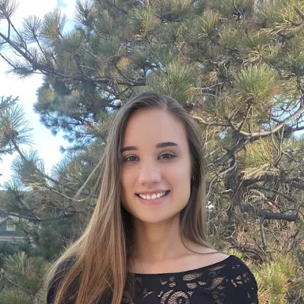

Isabella Lalena is a doctoral student in the CSNG lab. She graduated from George Mason University in 2019 with a B.S. in Psychology and Neuroscience. Her current research interests include neuroimaging, brain stimulation, and brain-computer interfaces.

